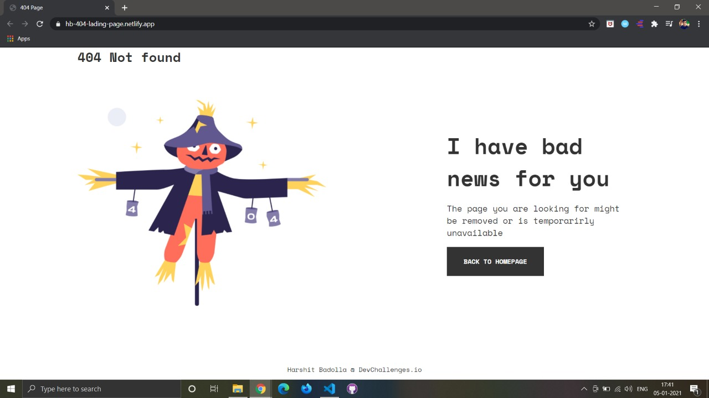

<!-- Please update value in the {}  -->

<h1 align="center">Responsive 404 page</h1>

   Solution for a challenge from  <a href="http://devchallenges.io" target="_blank">Devchallenges.io</a>.

  <h3>
    <a href="https://{https://hb-404-lading-page.netlify.app/}">
      Demo
    </a>
     | 
    <a href="https://{https://github.com/harshitbadollacodes/404-landing-page}">
      Solution
    </a>
     | 
    <a href="https://devchallenges.io/challenges/wBunSb7FPrIepJZAg0sY">
      Challenge
    </a>
  </h3>

<!-- TABLE OF CONTENTS -->

## Table of Contents

- [Overview](#overview)
  - [Built With](#built-with)
- [Features](#features)
- [Contact](#contact)
- [Acknowledgements](#acknowledgements)

<!-- OVERVIEW -->

## Overview

- Where can I see your demo?
You can see the demo by clicking [here](https://hb-404-lading-page.netlify.app/)

- What was your experience?
The challenge was to create a 404 landing page. I made use of flexbox to achieve the results. I had learnt about CSS flexbox and this challenge helped me check my thorough knowledge on the same. 

- What have you learned/improved?
While using flexbox, make sure you specify the widths of the child element or else the justify-content: space-betweem would not work.

### Built With

- [HTML](https://developer.mozilla.org/en-US/docs/Web/Guide/HTML/HTML5)
- [CSS](https://developer.mozilla.org/en-US/docs/Web/CSS)

## Features

<!-- List the features of your application or follow the template. Don't share the figma file here :) -->

This application/site was created as a submission to a [DevChallenges](https://devchallenges.io/challenges) challenge. The [challenge](https://devchallenges.io/challenges/wBunSb7FPrIepJZAg0sY) was to build an application to complete the given user stories.

## Acknowledgements

<!-- This section should list any articles or add-ons/plugins that helps you to complete the project. This is optional but it will help you in the future. For exmpale -->

- [Steps to replicate a design with only HTML and CSS](https://devchallenges-blogs.web.app/how-to-replicate-design/)
- [Node.js](https://nodejs.org/)
- [Marked - a markdown parser](https://github.com/chjj/marked)

## Contact

- Website [your-website.com](https://{your-web-site-link})
- GitHub [@your-username](https://{github.com/harshitbadolla})
- Twitter [@your-twitter](https://{twitter.com/code__bros})